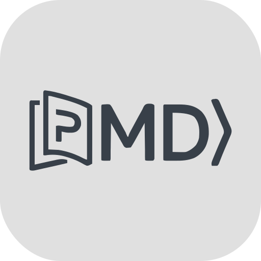

<p align="center">
  
</p>

<h1 align="center">PureMDread</h1>

<p align="center">
  <a href="https://github.com/wu66chen/PureMDread/stargazers">
    
  </a>
  <a href="https://github.com/wu66chen/PureMDread/network/members">
    
  </a>
  <a href="https://github.com/wu66chen/PureMDread/issues">
    
  </a>
  <a href="https://github.com/wu66chen/PureMDread/blob/main/LICENSE">
    
  </a>
</p>

<p align="center">
  <strong>A clean, local Markdown reader Chrome extension</strong>
  <br>
  Beautiful rendering with one click, no conversion · Light/Dark themes · Syntax highlighting · Auto TOC
  <br><br>
  <sub>Read this in <a href="README.md"><strong>中文</strong></a></sub>
</p>

<p align="center">
  
</p>

---

## ✨ Features

### 🎨 Core Rendering
- **Auto-detect & Render** - Automatically detects and renders `.md` / `.markdown` / `.mdown` / `.mkd` files opened in the browser
- **GitHub Style** - Faithfully reproduces the GitHub Flavored Markdown rendering style
- **GFM Support** - Full support for tables, task lists, strikethrough, and all GitHub Flavored Markdown features
- **Universal Syntax Highlighting** - Built-in Highlight.js, supporting virtually all programming languages

### 🌓 Theme System
- **Light & Dark Themes** - One-click toggle between light and dark modes
- **Preference Memory** - Theme selection is automatically saved and applied on next launch
- **Eye-Friendly Colors** - Light mode uses a soft `#e0e0e0` gray background for comfortable long reading sessions

### 📑 Reading Experience
- **Smart TOC Generation** - Automatically extracts document headings to generate a clickable table of contents
- **Font Size Control** - Three-level adjustment: A- / Reset / A+, ranging from 12px to 24px
- **One-click Print/PDF** - Built-in print button for exporting beautifully formatted PDF documents
- **Relative Path Image Fix** - Automatically resolves relative image paths in local Markdown files

### ⚡ Performance
- **Zero-latency Rendering** - Injected at `document_start`, renders as the page loads
- **No Network Dependency** - Runs entirely locally, collects zero data
- **Lightweight** - Full package under 500KB, minimal memory footprint

---

## 🚀 Installation

### Method 1: Developer Mode (Recommended)

1. Download the repository ZIP or clone it locally
2. Open Chrome and navigate to `chrome://extensions/`
3. Enable **Developer mode** in the top right corner
4. Click **Load unpacked**
5. Select the `markdown-reader-extension` folder
6. ⚠️ **Important**: Click "Details" on the extension card → Enable **Allow access to file URLs**

### Method 2: Chrome Web Store

> 🔜 Coming soon to Chrome Web Store

---

## 📖 Usage

### Basics
1. Drag and drop a local `.md` file directly into Chrome
2. Or enter a local file path in the address bar: `file:///path/to/your/file.md`
3. The extension will automatically render it for a beautiful reading experience

### Toolbar
| Button | Function |
|--------|----------|
| 📑 | Show/hide Table of Contents |
| 🌓 | Toggle Light/Dark theme |
| **A-** | Decrease font size |
| **↺** | Reset font size (16px) |
| **A+** | Increase font size |
| 🖨️ | Print / Export PDF |

---

## ⚙️ Configuration

### File Type Matching
The extension automatically renders local files with the following extensions:
- `.md`
- `.markdown`
- `.mdown`
- `.mkd`

To add more extensions, configure `content_scripts.matches` in `manifest.json`.

### Permissions
- `storage` - Used to save your theme preference
- `file:///*` - Required to access local Markdown files (must be manually enabled)

---

## 🛠️ Tech Stack

| Technology | Version | Purpose |
|------------|---------|---------|
| Chrome Extension | Manifest V3 | Extension framework |
| Marked.js | v11.1.1 | Markdown parsing engine |
| Highlight.js | v11.9.0 | Code syntax highlighting |
| GitHub Markdown CSS | v5.5.0 | Rendering styles |
| Vanilla JavaScript | ES6+ | Business logic |

> **Zero Framework Dependency** - Pure vanilla implementation, no React/Vue, maximum performance

---

## 📁 Project Structure

```
markdown-reader-extension/
├── manifest.json              # Extension configuration file
├── popup.html                 # Toolbar popup panel
├── README.md                  # This file
├── css/
│   ├── style.css              # Custom theme styles
│   ├── github-markdown.css    # GitHub Markdown styles
│   └── highlight-github.css   # Code highlighting styles
├── js/
│   ├── content.js             # Core rendering logic
│   ├── popup.js               # Popup panel logic
│   ├── marked.min.js          # Marked.js library
│   └── highlight.min.js       # Highlight.js library
└── icons/
    ├── icon.svg               # SVG vector icon
    ├── icon16.png             # 16×16 toolbar icon
    ├── icon48.png             # 48×48 extension management icon
    └── icon128.png            # 128×128 store icon
```

---

## 🤝 Contributing

Issues and Pull Requests are welcome!

### Development Guide
1. Fork this repository
2. Create a feature branch: `git checkout -b feature/AmazingFeature`
3. Commit your changes: `git commit -m 'Add some AmazingFeature'`
4. Push to the branch: `git push origin feature/AmazingFeature`
5. Open a Pull Request

---

## 📝 Changelog

### v1.0.0 (2026-06-12)
- ✅ Initial release
- ✅ Markdown auto-rendering
- ✅ Light/Dark theme toggle
- ✅ Smart TOC generation
- ✅ Font size adjustment
- ✅ Code syntax highlighting
- ✅ Local image path resolution

---

## 📄 License

This project is licensed under the **MIT License** - see the [LICENSE](LICENSE) file for details.

---

<p align="center">
  <strong>Made with ❤️ for developers who love reading Markdown</strong>
  <br>
  <sub>If you find this useful, please give it a ⭐ Star!</sub>
</p>
